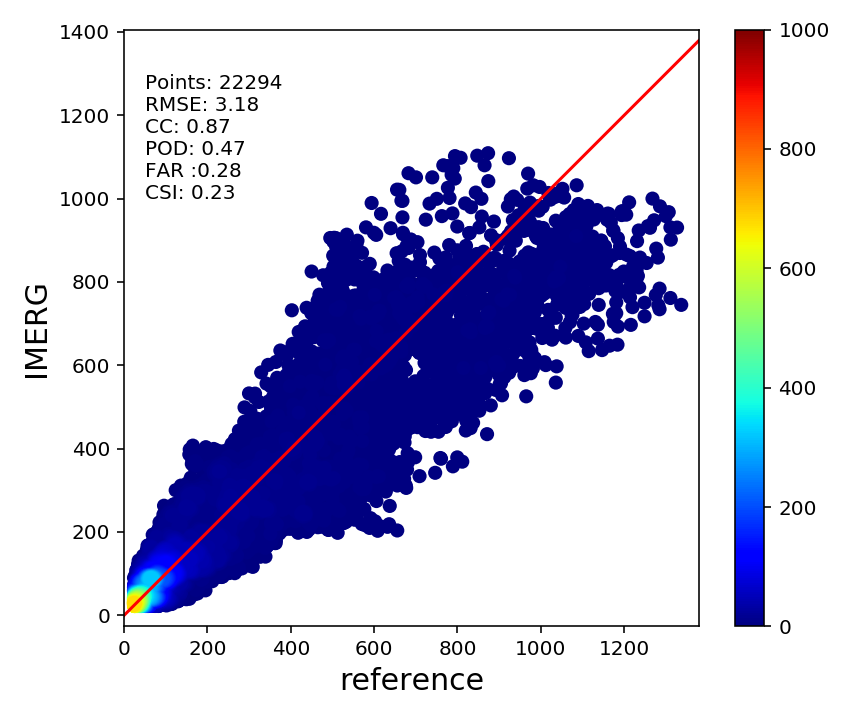

# PlotGallary

This is a collection of fancy plots that is useful in my work!

basic.py: matplotlib configurations for producing publification-level graphs

density_scatter_plot.py: producing color coded density for scatter plot like below:

hydrograph.ipynb:
